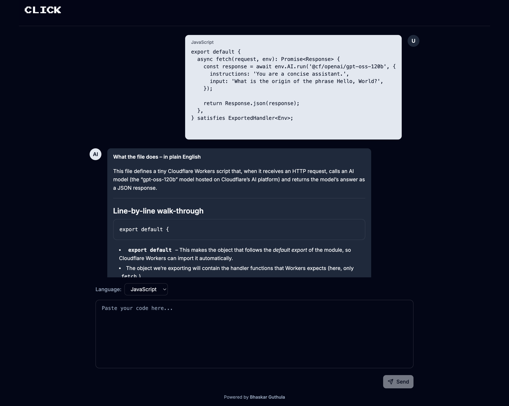

# AI Code Explainer

A modern, full-stack web application that uses AI to explain code in simple, understandable terms. Built with React Router, Cloudflare Workers, and powered by GPT-OSS-120B, this application provides an interactive ChatGPT-like interface for code explanation.


## 🚀 Live Demo

**🔗 [View Live Application](https://ai-code-explainer.bhaskarg.workers.dev)**



## 🎯 Project Overview

AI Code Explainer is a production-ready application that helps developers understand code by providing AI-powered explanations. Users can paste code snippets in various programming languages and receive detailed, markdown-formatted explanations with a smooth typing animation effect.

### Key Highlights

- **AI-Powered Explanations**: Leverages Cloudflare's GPT-OSS-120B model for accurate code explanations
- **ChatGPT-like Interface**: Modern, conversational UI with typing animations and markdown rendering
- **Edge Computing**: Deployed on Cloudflare Workers for global low-latency performance
- **Production-Ready**: Includes rate limiting, CORS, security headers, and body size limits
- **Type-Safe**: Built entirely with TypeScript for reliability and maintainability

## ✨ Features

### Core Functionality
- ✅ **Multi-Language Support**: Supports 16+ programming languages (JavaScript, TypeScript, Python, Java, C++, Go, Rust, and more)
- ✅ **Real-Time Typing Animation**: ChatGPT-style character-by-character text animation (3ms per character)
- ✅ **Markdown Rendering**: Beautifully formatted explanations with code blocks, headings, lists, and links
- ✅ **Interactive Chat Interface**: Message history with user and assistant messages
- ✅ **Message Actions**: Stop, Copy, and Edit buttons for enhanced UX

### Security & Performance
- ✅ **Rate Limiting**: 100 requests per 15 minutes per IP address
- ✅ **Body Size Limits**: 10MB request size limit with proper error handling
- ✅ **CORS Protection**: Configurable origin-based CORS with preflight support
- ✅ **Security Headers**: Helmet-like security headers (XSS protection, frame options, CSP, etc.)
- ✅ **Error Handling**: Comprehensive error handling with user-friendly messages

### User Experience
- ✅ **Form Validation**: React Hook Form integration for robust form handling
- ✅ **Loading States**: Visual feedback during API requests
- ✅ **Responsive Design**: Mobile-friendly interface with Tailwind CSS
- ✅ **Dark Mode Support**: Built-in dark theme support
- ✅ **Accessibility**: Semantic HTML and ARIA-compliant components

## 🛠️ Tech Stack

### Frontend
- **React 19.1.1** - Latest React with modern hooks and patterns
- **React Router 7.9.2** - Full-stack framework with SSR support
- **TypeScript 5.9.2** - Type-safe development
- **Tailwind CSS 4.1.13** - Utility-first styling
- **React Hook Form 7.66.0** - Performant form management
- **React Markdown 10.1.0** - Markdown rendering
- **Lucide React** - Modern icon library
- **Radix UI** - Accessible component primitives

### Backend & Infrastructure
- **Cloudflare Workers** - Edge computing platform
- **Cloudflare AI** - GPT-OSS-120B model integration
- **React Router SSR** - Server-side rendering
- **Wrangler** - Cloudflare Workers deployment tool

### Development Tools
- **Vite 7.1.7** - Fast build tool and dev server
- **TypeScript** - Type checking and compilation
- **ESLint** - Code linting (if configured)

## 📁 Project Structure

```
ai-code-explainer/
├── app/
│   ├── components/
│   │   ├── layout.tsx              # Main layout component
│   │   ├── markdown-renderer.tsx   # Client-side markdown renderer
│   │   ├── typing-animation.tsx    # ChatGPT-style typing animation
│   │   └── ui/
│   │       └── button.tsx          # Reusable button component
│   ├── lib/
│   │   ├── middleware.ts           # Security, rate limiting, CORS middleware
│   │   └── utils.ts                # Utility functions
│   ├── routes/
│   │   ├── home.tsx                # Main chat interface
│   │   └── explain-code.ts        # API endpoint for code explanation
│   ├── root.tsx                    # Root layout with error boundaries
│   └── app.css                     # Global styles and Tailwind config
├── workers/
│   └── app.ts                      # Cloudflare Worker entry point
├── wrangler.jsonc                  # Cloudflare Workers configuration
├── vite.config.ts                  # Vite build configuration
└── package.json                    # Dependencies and scripts
```

## 🚀 Getting Started

### Prerequisites

- **Node.js** 18+ and npm/bun
- **Cloudflare Account** (for deployment)
- **Cloudflare AI Access** (for AI model usage)

### Installation

1. **Clone the repository**
   ```bash
   git clone <repository-url>
   cd ai-code-explainer
   ```

2. **Install dependencies**
   ```bash
   npm install
   # or
   bun install
   ```

3. **Generate Cloudflare types**
   ```bash
   npm run cf-typegen
   ```

### Development

Start the development server with hot module replacement:

```bash
npm run dev
```

The application will be available at `http://localhost:5173`.

### Building for Production

Create a production build:

```bash
npm run build
```

Preview the production build locally:

```bash
npm run preview
```

### Type Checking

Run TypeScript type checking:

```bash
npm run typecheck
```

## 🌐 Deployment

### Cloudflare Workers

Deploy directly to Cloudflare Workers:

```bash
npm run deploy
```

This will:
1. Build the application
2. Deploy to Cloudflare Workers
3. Make it available at your configured Workers URL

### Environment Configuration

Configure your deployment in `wrangler.jsonc`:

```jsonc
{
  "name": "ai-code-explainer",
  "vars": {
    "FRONTEND_URL": "https://your-domain.com"
  },
  "ai": {
    "binding": "AI"
  }
}
```

## 🔧 Configuration

### Rate Limiting

Adjust rate limits in `workers/app.ts`:

```typescript
rateLimit: {
  maxRequests: 100,        // Number of requests
  windowMs: 15 * 60 * 1000, // Time window (15 minutes)
}
```

### Body Size Limit

Modify body size limit in `workers/app.ts`:

```typescript
bodySizeLimit: "10mb"  // Change to "5mb", "20mb", etc.
```

### CORS Origin

Set allowed CORS origin in `wrangler.jsonc`:

```jsonc
{
  "vars": {
    "FRONTEND_URL": "https://your-allowed-origin.com"
  }
}
```

## 🏗️ Architecture

### Request Flow

1. **Client Request** → User submits code via form
2. **Middleware Layer** → Rate limiting, body size check, CORS validation
3. **API Route** → `/explain-code` endpoint processes request
4. **AI Integration** → Cloudflare AI model generates explanation
5. **Response** → Markdown-formatted explanation returned
6. **UI Update** → Typing animation displays explanation

### Security Features

- **Rate Limiting**: In-memory rate limiter (can be upgraded to Cloudflare KV/Durable Objects)
- **CORS**: Origin-based access control with preflight support
- **Security Headers**: XSS protection, frame options, CSP, HSTS
- **Input Validation**: Form validation and sanitization
- **Error Handling**: Graceful error handling with user feedback

## 📊 API Endpoints

### POST `/explain-code`

Explains code using AI.

**Request Body:**
```json
{
  "code": "function hello() { console.log('Hello'); }",
  "language": "JavaScript"
}
```

**Response:**
```json
{
  "explanation": "This function...",
  "language": "JavaScript",
  "usage": {
    "input_tokens": 50,
    "output_tokens": 200,
    "total_tokens": 250
  }
}
```

## 🎨 UI/UX Features

- **ChatGPT-like Interface**: Familiar conversational UI
- **Typing Animation**: Smooth character-by-character reveal (3ms speed)
- **Markdown Support**: Rich text formatting with code blocks
- **Message Actions**: Stop, Copy, and Edit functionality
- **Responsive Design**: Works on all device sizes
- **Dark Mode**: Built-in dark theme support

## 🔒 Security Considerations

- Rate limiting prevents abuse
- CORS restricts cross-origin requests
- Security headers protect against common attacks
- Input validation prevents malicious payloads
- Error messages don't expose sensitive information

## 📝 License

This project is private and proprietary.

## 👤 Author

**Bhaskar Guthula**

Built with modern web technologies and best practices for production deployment.

---

**Note**: This application requires Cloudflare Workers and AI access. Ensure you have the necessary permissions and quotas configured in your Cloudflare account.
